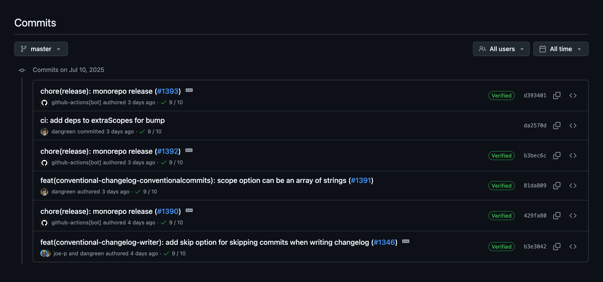
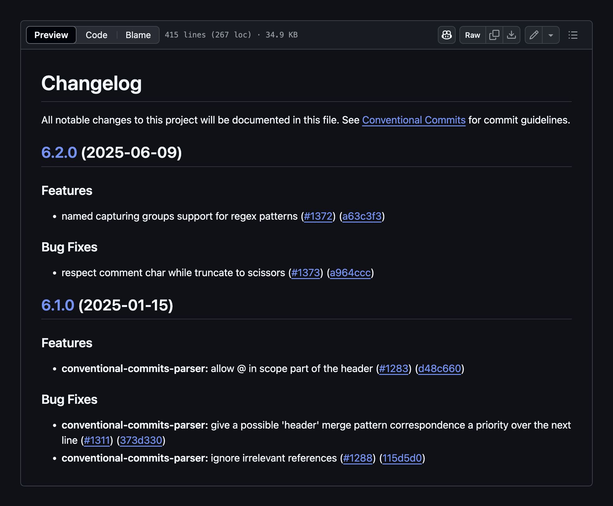
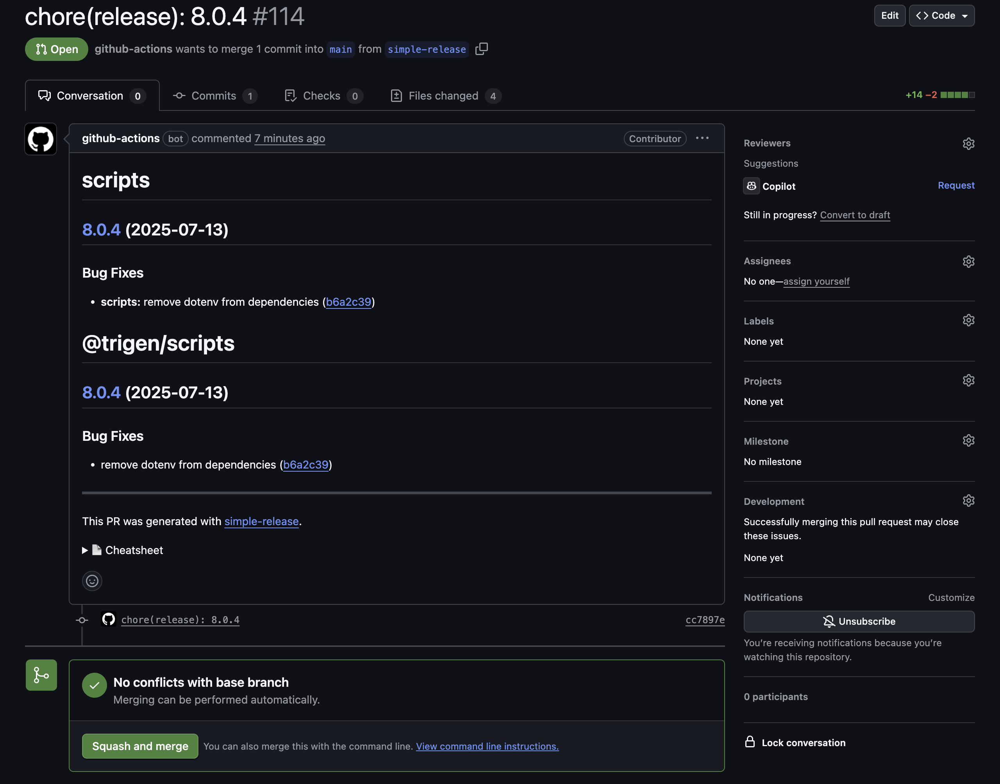
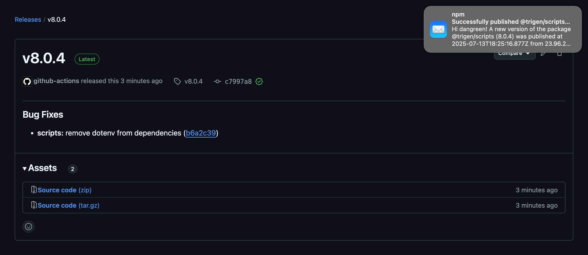

[Conventional Commits](https://www.conventionalcommits.org/en/v1.0.0/) is a specification for adding human and machine readable meaning to commit messages. It provides an easy set of rules for creating an explicit commit history, which makes it easier to write automated tools on top of.



## Basic Structure

The commit message should be structured as follows:

```
<type>[optional scope]: <description>

[optional body]

[optional footer(s)]
```

Examples:

```bash
# Feature addition
feat: add user authentication

# Bug fix
fix: resolve login redirect issue

# Breaking change
feat!: migrate to new API endpoint

# Also breaking change
feat: add new payment method

BREAKING CHANGE: migrate to new payment gateway

# With scope
feat(auth): add password reset functionality

# With body and footer
fix: prevent racing of requests

Introduce a request id and a reference to latest request. Dismiss
incoming responses other than from latest request.

Closes #123
```

## Common Types

- **feat**: A new feature
- **fix**: A bug fix
- **docs**: Documentation changes
- **style**: Code style changes (formatting, missing semicolons, etc.)
- **refactor**: Code refactoring without changing functionality
- **test**: Adding or updating tests
- **chore**: Maintenance tasks, dependency updates

## Benefits of Conventional Commits

### 1. Automatic Version Determination

Conventional commits enable automatic semantic versioning:
- **feat**: triggers a minor version bump (1.0.0 → 1.1.0)
- **fix**: triggers a patch version bump (1.0.0 → 1.0.1)
- **BREAKING CHANGE**: triggers a major version bump (1.0.0 → 2.0.0)

### 2. Automatic Changelog Generation

Tools can automatically generate changelogs by parsing commit messages, grouping them by type, and extracting relevant information.



### 3. Better Project History

Conventional commits create a more readable and searchable project history, making it easier to understand what changes were made and why.

## Setting Up Full Automation

To achieve complete automation of versioning and releases, you'll need several tools working together. Let's set them up step by step.

### 1. Commitlint

While not mandatory, [Commitlint](https://github.com/conventional-changelog/commitlint) helps enforce conventional commit standards by linting commit messages.

First, install Commitlint and the Conventional Commits plugin:

```bash
npm install --save-dev @commitlint/cli @commitlint/config-conventional
```

Then you need to set up a configuration.

#### Simple Project Configuration

For a basic project, create `.commitlintrc.json`:

```json
{
  "extends": ["@commitlint/config-conventional"]
}
```

##### Git Hook

Now you can set up commit validation during `git commit`, for example using [simple-git-hooks](https://github.com/toplenboren/simple-git-hooks), though there are other similar tools available ([husky](https://github.com/typicode/husky), [pre-commit](https://github.com/observing/pre-commit), etc.).

Install simple-git-hooks:

```bash
npm install --save-dev simple-git-hooks
```

Create `.simple-git-hooks.json`:

```json
{
  "commit-msg": "npx commitlint --edit \"$1\""
}
```

Now run `npx simple-git-hooks` to activate the hooks and you're ready to go!

##### GitHub Action

You can also set up commit linting via GitHub Actions when commits are pushed to the repository.

Create `.github/workflows/commit.yml`:

```yaml
name: Commit Validation

on:
  pull_request:
    types: [opened, synchronize]

jobs:
  commitlint:
    runs-on: ubuntu-latest
    steps:
      - uses: actions/checkout@v4
        with:
          fetch-depth: 0

      - name: Setup Node.js
        uses: actions/setup-node@v4
        with:
          node-version: '18'
          cache: 'npm'

      - name: Install dependencies
        run: npm ci

      - name: Validate commit messages
        run: npx commitlint --from=HEAD~1
```

#### Monorepo Project Configuration

In monorepos, it's common practice to use scopes in Conventional Commits that correspond to workspace names in the monorepo. This helps identify which workspace(s) are affected by each commit. For example:

```bash
feat(store): add user authentication state
fix(ui): resolve button styling issue
docs(router): update routing configuration guide
```

You can use specialized packages to automatically get project scopes:

- [@commitlint/config-workspace-scopes](https://github.com/conventional-changelog/commitlint/tree/master/@commitlint/config-workspace-scopes) - for generic workspaces
- [@commitlint/config-pnpm-scopes](https://github.com/conventional-changelog/commitlint/tree/master/@commitlint/config-pnpm-scopes) - for pnpm workspaces
- [@commitlint/config-lerna-scopes](https://github.com/conventional-changelog/commitlint/tree/master/@commitlint/config-lerna-scopes) - for Lerna projects

Let's look at an example for pnpm workspaces:

Install the packages:

```bash
pnpm add -D @commitlint/cli @commitlint/config-conventional @commitlint/config-pnpm-scopes
```

Create `.commitlintrc.js`:

```javascript
import scopes from '@commitlint/config-pnpm-scopes'

export default {
  extends: ['@commitlint/config-conventional', '@commitlint/config-pnpm-scopes'],
  rules: {
    'scope-enum': async (ctx) => {
      const scopeEnum = await scopes.rules['scope-enum'](ctx)
      return [
        scopeEnum[0],
        scopeEnum[1],
        [
          ...scopeEnum[2],
          'deps',     // for Dependabot or Renovate - dependency updates
          'dev-deps', // for Dependabot or Renovate - dev dependency updates
          'release'   // for release commits
        ]
      ]
    }
  },
  prompt: {
    settings: {
      enableMultipleScopes: true
    }
  }
}
```

### 2. Commitizen

[Commitizen](https://github.com/commitizen/cz-cli) is an optional but very convenient tool that provides an interactive CLI for creating Conventional Commits.


First, install Commitizen and the Commitlint adapter:

```bash
npm install --save-dev commitizen @commitlint/cz-commitlint
```

Then create `.czrc`:

```json
{
  "path": "@commitlint/cz-commitlint"
}
```

Add a script to `package.json`:

```json
{
  "scripts": {
    "commit": "cz"
  }
}
```

Now you can use `npm run commit` instead of `git commit` for interactive commit creation.

### 3. Simple Release Action

The [simple-release-action](https://github.com/marketplace/actions/simple-release-action) is a comprehensive GitHub Action that automates version updates, changelog generation, and releases. The project is based on [simple-release](https://github.com/TrigenSoftware/simple-release) and [conventional-changelog](https://github.com/conventional-changelog/conventional-changelog).

*If you are not using GitHub, you can write your own custom CI script using the [@simple-release/core](https://github.com/TrigenSoftware/simple-release/tree/main/packages/core) package.*

Key Features:

- **First-class monorepo support** - A major differentiator from alternatives
- **Automatic version bumping** based on Conventional Commits
- **Changelog generation** with proper categorization
- **Git tagging and GitHub releases**
- **Configuration through adapters** for different project types

Currently npm and pnpm projects with workspaces are supported ([npm adapter](https://github.com/TrigenSoftware/simple-release/blob/main/packages/npm#readme), [pnpm adapter](https://github.com/TrigenSoftware/simple-release/blob/main/packages/pnpm#readme)).

Let's look at an example of configuring the action for a project with pnpm workspaces using [@simple-release/pnpm](https://github.com/TrigenSoftware/simple-release/blob/main/packages/pnpm#readme) addon:

Create `.simple-release.json` config file in repository root:

```json
{
  "project": ["@simple-release/pnpm#PnpmWorkspacesProject", {
    "mode": "fixed"
  }],
  "bump": {
    "extraScopes": ["deps"]
  }
}
```

*`extraScopes` is used to trigger version bump by commits like `fix(deps): ...` from Dependabot or Renovate.*

Create `.github/workflows/release.yml`:

```yaml
name: Release

on:
  issue_comment:
    types: [created, deleted]
  push:
    branches:
      - main

jobs:
  check:
    runs-on: ubuntu-latest
    name: Context check
    outputs:
      continue: ${{ steps.check.outputs.continue }}
      workflow: ${{ steps.check.outputs.workflow }}
    steps:
      - name: Checkout the repository
        uses: actions/checkout@v4
      - name: Context check
        id: check
        uses: TrigenSoftware/simple-release-action@v1
        with:
          workflow: check
          github-token: ${{ secrets.GITHUB_TOKEN }}

  pull-request:
    runs-on: ubuntu-latest
    name: Pull request
    needs: check
    if: needs.check.outputs.workflow == 'pull-request'
    steps:
      - name: Checkout the repository
        uses: actions/checkout@v4
      - name: Create or update pull request
        uses: TrigenSoftware/simple-release-action@v1
        with:
          workflow: pull-request
          github-token: ${{ secrets.GITHUB_TOKEN }}

  release:
    runs-on: ubuntu-latest
    name: Release
    needs: check
    if: needs.check.outputs.workflow == 'release'
    steps:
      - name: Checkout the repository
        uses: actions/checkout@v4
      - name: Install pnpm
        uses: pnpm/action-setup@v2
        with:
          version: 10
      - name: Install Node.js
        uses: actions/setup-node@v4
        with:
          node-version: 18
          cache: 'pnpm'
          registry-url: 'https://registry.npmjs.org'
      - name: Install dependencies
        run: pnpm install
      - name: Release
        uses: TrigenSoftware/simple-release-action@v1
        with:
          workflow: release
          github-token: ${{ secrets.GITHUB_TOKEN }}
          npm-token: ${{ secrets.NPM_TOKEN }}
```

This workflow consists of three jobs:
- **check** - performs context check to determine if release changes are needed and which workflow to run
- **pull-request** - creates or updates a pull request with release changes
- **release** - performs the actual release when the PR is merged

Every time you push to the main branch, the action will create or update a pull request with a version bump and updated changelog if necessary.



When the pull request is merged, it will automatically release the project.



## Conclusion

There is also a recommendation to use squash merge for pull requests to keep the commit history in the main branch clean and well-structured. This ensures that each merge commit follows conventional commit standards and makes the project history more readable.

By implementing Conventional Commits with this toolchain, you'll have a fully automated release pipeline that maintains consistency, improves project history readability, and reduces manual overhead in version management.

If you want to see real projects using Conventional Commits and their configurations, here are a few examples:
- [browserslist-useragent-regexp](https://github.com/browserslist/browserslist-useragent-regexp)
- [conventional-changelog](https://github.com/conventional-changelog/conventional-changelog)
- [simple-release](https://github.com/TrigenSoftware/simple-release)
