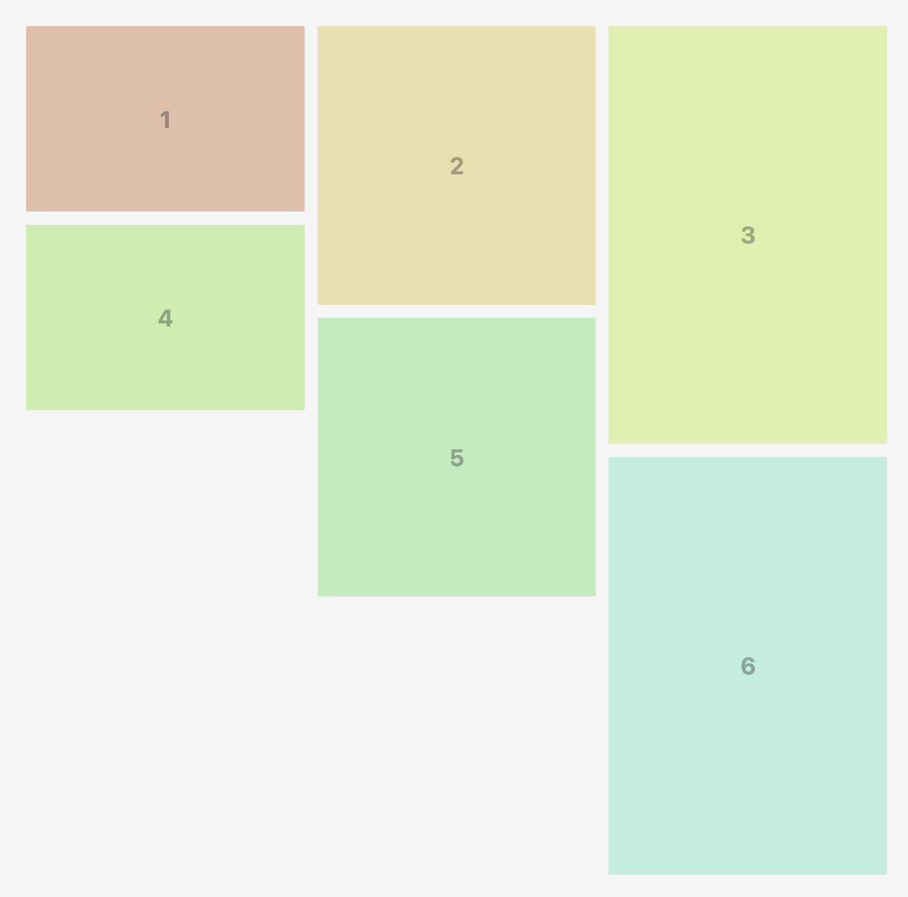
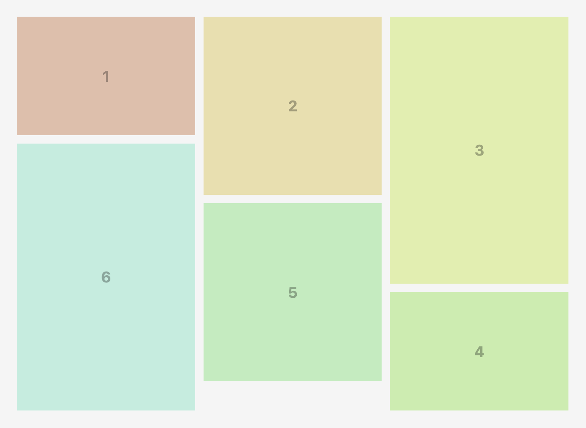

You know that satisfying Pinterest-style grid where images of different sizes fit together like a perfect puzzle? It's a common UI pattern, but implementing it properly has always been surprisingly tricky.

Meet [Masonry Grid](https://masonry-grid.js.org/) - a modern, lightweight solution that takes a different approach to this classic problem.


## How Can You Build Masonry Layout Today?

Let's look at what options we actually have in 2025:

### Option 1: Native CSS Masonry

"Just use CSS Grid's masonry layout!" - sounds great, right? Well...

```css
.grid {
  display: grid;
  grid-template-rows: masonry; /* Sounds perfect! */
}
```

The problem? [It's still experimental](https://developer.mozilla.org/en-US/docs/Web/CSS/CSS_grid_layout/Masonry_layout). We don't know when it'll land, let alone when it'll be widely available enough to actually use in production.

### Option 2: The Classic - Masonry.js

Google "masonry layout javascript" and the first result is [Masonry by David DeSandro](https://github.com/desandro/masonry).

But... The last commit was in 2017 and it weighs something around ~24 kB. In 2025, that feels... outdated.

### Option 3: Pure CSS Solutions

"Can't we just do it with CSS?" - technically yes! There are [clever CSS-only solutions](https://theosoti.com/short/masonry-layout/) using CSS columns:

```css
.masonry {
  column-width: 200px;
  gap: 1em;
}
```

The browser fits as many columns as possible. Looks great! But there are issues:

- Items flow **vertically** (column 1 fills top to bottom, then column 2...) which breaks logical order
- Browser compatibility is spotty for edge cases
- Only works with static content - good luck adding dynamic data
- Not so responsive as you'd like

### Option 4: HTML Columns with JavaScript

There's also [a composable approach](https://piccalil.li/blog/a-simple-masonry-like-composable-layout/) where you create actual column elements in HTML and distribute items between them with JavaScript:

```html
<div class="masonry">
  <div class="column"><!-- items 0, 3, 6... --></div>
  <div class="column"><!-- items 1, 4, 7... --></div>
  <div class="column"><!-- items 2, 5, 8... --></div>
</div>
```

This gives you proper horizontal order! But here's the catch:

**Responsive design becomes tricky.** If you want the column count to change based on screen size, you need to recalculate and redistribute items on resize. And that creates another problem...

**Server-side rendering.** The server doesn't know the screen width, so it can't calculate how many columns to create or how to distribute items.

## Enter Masonry Grid

So I decided to build my own solution and share it with you.

Meet [Masonry Grid](https://masonry-grid.js.org/) - a **1.4 kB** library that works with any framework, compatible with SSR, and is built using modern web technologies to be as fast as possible.

The core algorithm is written in vanilla JavaScript, but there are wrappers for most popular frameworks ([React](https://masonry-grid.js.org/api/react/), [Preact](https://masonry-grid.js.org/api/preact/), [Svelte](https://masonry-grid.js.org/api/svelte/), [SolidJS](https://masonry-grid.js.org/api/solid-js/)) that feel native to each ecosystem.

The interesting part isn't just the size - it's the approach.

## The Key Insight: Let CSS Do the Heavy Lifting

Most masonry libraries calculate positions in pixels and set absolute positioning. This means recalculating everything on every resize. Ugh.

Instead, Masonry Grid does something clever:

1. **Use CSS Grid as the base** - let the browser handle column layout naturally
2. **Define aspect ratios with CSS variables** - each item knows its own proportions
3. **Use percentage-based transforms** - pull items up to fill gaps without pixel calculations
4. **Watch for changes with ResizeObserver and MutationObserver** - only recalculate when necessary

```tsx
import { BalancedMasonryGrid, Frame } from '@masonry-grid/react'

<BalancedMasonryGrid className="masonry">
  <Frame width={3} height={2}>
    
  </Frame>
  <Frame width={1} height={1}>
    
  </Frame>
  <Frame width={3} height={2}>
    
  </Frame>
  {/* More photos... */}
</BalancedMasonryGrid>
```

That's it. No absolute positioning. Just tell each item its aspect ratio, and the library handles the rest.

## The Secret Sauce

Under the hood, this library leverages CSS variables and transforms in a clever way.

```html
<div class="masonry" style="height: 589.651px;">
  <div style="--width: 3; --height: 2;"><!-- Your image --></div>
  <div style="--width: 1; --height: 1;"><!-- Your image --></div>
  <div style="--width: 3; --height: 2;"><!-- Your image --></div>
  <div style="--width: 1; --height: 1; transform: translateY(-33.3333%);"><!-- Your image --></div>
  <div style="--width: 3; --height: 2;"><!-- Your image --></div>
  <div style="--width: 2; --height: 3; transform: translateY(-22.2222%);"><!-- Your image --></div>
  <!-- ending div is added for internal calculations: -->
  <div></div>
</div>
```

See that `transform: translateY(-33.3333%)`? That's pulling the item up by a percentage of *its own height*. Because we know the aspect ratio from CSS variables, we can calculate everything in percentages.

This means when you resize the window, the layout stays perfect without recalculating - the browser handles it natively! **Recalculation only happens when the number of columns changes**, not on every resize event.

And here's the bonus: since we're building on top of CSS Grid, you get all the flexibility that comes with it. Want fluid columns that adapt to available space? Just use `repeat(auto-fit, minmax(200px, 1fr))` or similar techniques. The masonry algorithm works perfectly with whatever column setup Grid gives you - whether it's fixed widths, percentage-based, or fully responsive with `auto-fit`. The layout remains fluid and adapts naturally to any screen size.

## Two Flavors: Regular and Balanced

The library comes with two layout algorithms:

The **regular** version - items flow naturally into columns, gaps get filled by pulling items up. Classic masonry.



The **balanced** algorithm takes it further - it reorders items within each row to minimize wasted space. The clever part? It uses the CSS `order` property, so the DOM order stays intact, but visually everything is optimized.



Both are included, both are tiny, use whichever fits your needs.

Want to see them in action? Check out [the examples](https://masonry-grid.js.org/examples/).

## SSR Compatibility

One major advantage of the CSS-based approach: **the library is compatible with SSR!**

Since the layout is built purely through CSS (transforms and CSS variables), the DOM tree isn't actively restructured. This means hydration passes without issues - no hydration mismatches.

Of course, the server can't pre-calculate the layout since it doesn't know the screen size. But that's okay - the layout will be calculated on the client side after hydration, and because it's CSS-based, there won't be massive DOM manipulations that break hydration.

**Tip:** To avoid layout shifts and flickers, use the opacity trick - render with `opacity: 0` from the server, then set `opacity: 1` with a transition after mount on the client. Looks clean and smooth.

```css
.masonry {
  opacity: 0;
  transition: opacity 0.3s ease-in-out;
}
```

```jsx
import { useRef, useEffect } from 'react';
import { BalancedMasonryGrid, Frame } from '@masonry-grid/react'

export function MyMasonry() {
  const containerRef = useRef(null);

  useEffect(() => {
    if (containerRef.current) {
      containerRef.current.style.opacity = '1';
    }
  }, []);

  return (
    <BalancedMasonryGrid className="masonry" ref={containerRef}>
      {/* Your frames here */}
    </BalancedMasonryGrid>
  );
}
```

## Conclusion

Masonry Grid offers a fresh take on the classic masonry layout problem. By leveraging modern CSS techniques and a lightweight JavaScript core, it provides a solution that's fast, flexible, and compatible with today's web development needs.

**Give it a try!** Check out the [Getting Started guide](https://masonry-grid.js.org/getting-started/) to integrate it into your project, or explore [interactive examples](https://masonry-grid.js.org/examples/) to see it in action.

The library is open source and available on [GitHub](https://github.com/TrigenSoftware/masonry-grid). Contributions, feedback, and bug reports are always welcome!
